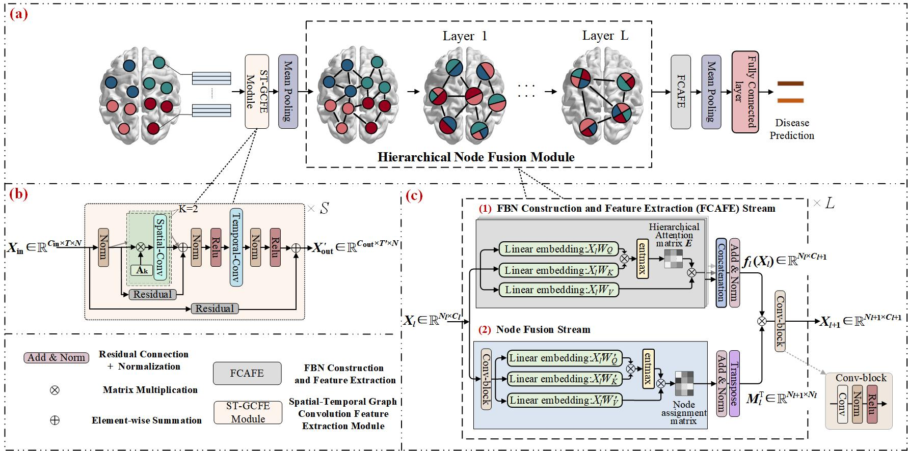

#Constructing Hierarchical Attentive Functional Brain Networks for Early AD Diagnosis.

---
#Overview
---

---

---
This is the code for our MEDIA paper:

Zhang J, Guo Y, Zhou L, et al. Constructing hierarchical attentive functional brain networks for early AD diagnosis[J]. Medical Image Analysis, 2024: 103137.（https://doi.org/10.1016/j.media.2024.103137)

---
#Train the model

```
	python  train.py --partroi 270 --num_pooling 1 --assign_ratio 0.35 --assign_ratio_1 0.35 --mult_num 8
```

---

#Quick start

	Before training the model, please configure the dependencies in the requirements.txt.

#Citation

    @article{zhang2024constructing,
  	title = {Constructing hierarchical attentive functional brain networks for early AD diagnosis},
  	author = {Zhang, Jianjia and Guo, Yunan and Zhou, Luping and Wang, Lei and Wu, Weiwen and Shen, Dinggang},
  	journal = {Medical Image Analysis},
  	pages = {103137},
  	year = {2024},
  	publisher = {Elsevier}
	}
    